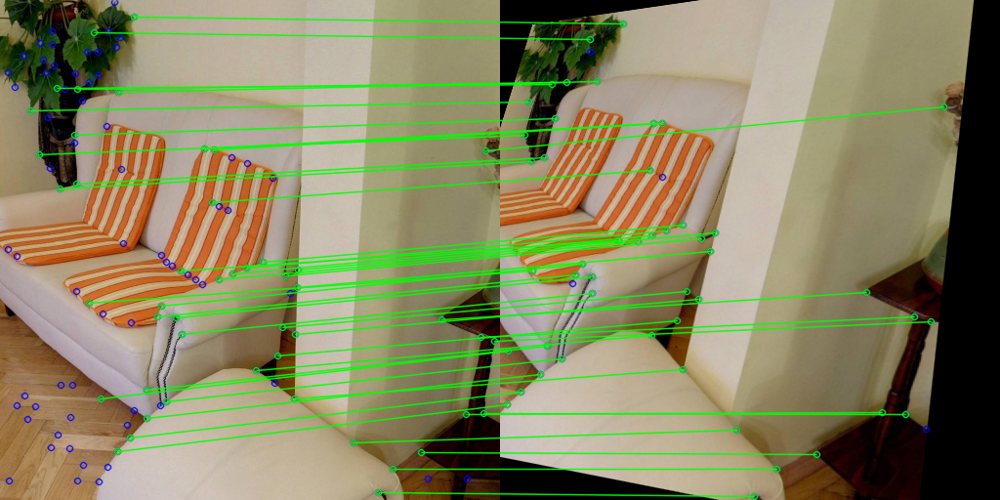

# SuperPanoPoint
SuperPoint like feature point detector and descriptor.



## Installation
```
$ poetry install (add '-E training' to install training dependencies)
```
Install pytorch depending on your environment. I've tested with pytorch==2.0.1 which can be installed with `requirements_torch_gpu/cpu.txt`.

## Usage
### Prediction
```python
from superpanopoint.predictors import UnetPredictor
weight = "model.pth"
cfg = "config/config_unet.yaml"
predictor = UnetPredictor(cfg, weight)
img = np.array(Image.open("sample.png"))
points, desc = predictor(img)
```
### Training
```
$ poetry run python train.py
```
It currently supports training MagicPoint model and SuperPoint model.
For training MagicPoint model, you need to generate dataset by executing `generate_dataset.py` before training.

For training SuperPoint model, you need to generrate pseudo ground truth feature points with trained MagicPoint model by executing `generate_pseudo_labels.py` before training.

